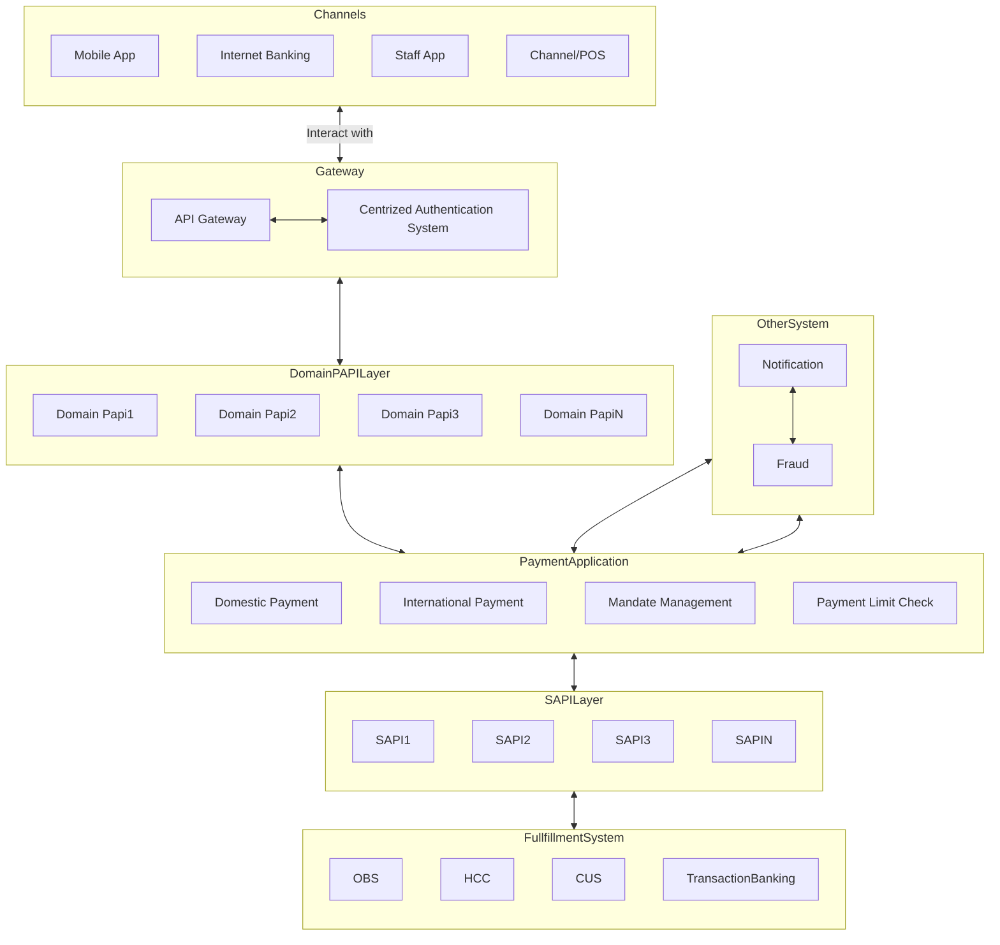
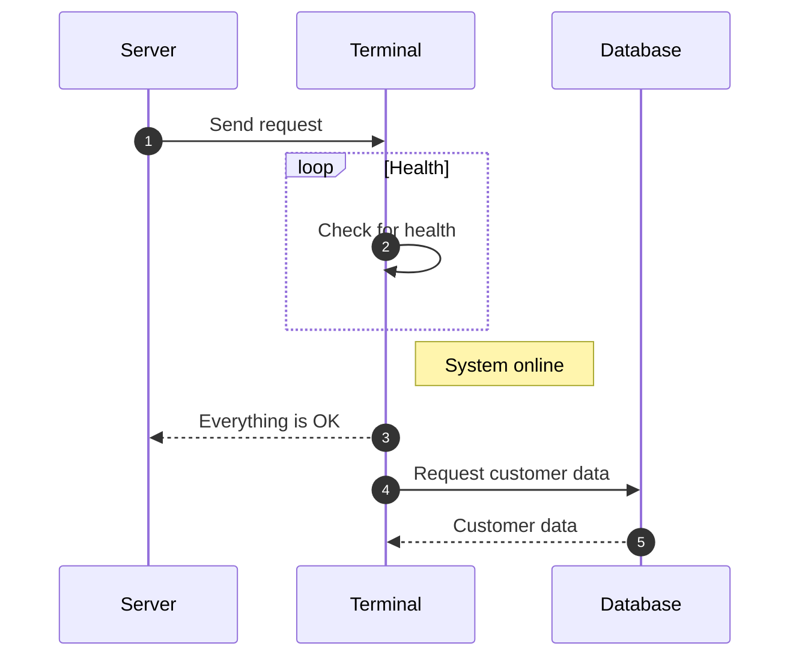

This includes -

1. Logical architecture, including key components, their relationships, and the overallsystem flow

2. Different channels integration with System, communication protocols and dataformats between different system components/Channel.

3. Purpose, responsibilities, and functionality of each component.

4. Highlights the interfaces, inputs, outputs, or interactions with other components.

## Logical Architecture Flow

## Application Flow

## Sequence Diagrams

## Component Diagrams

