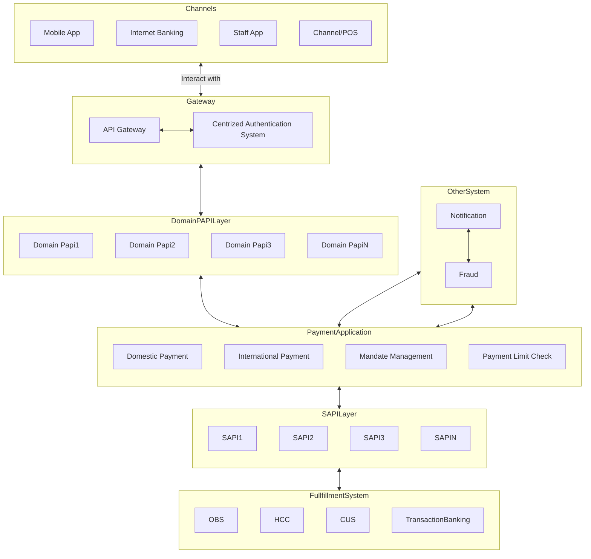
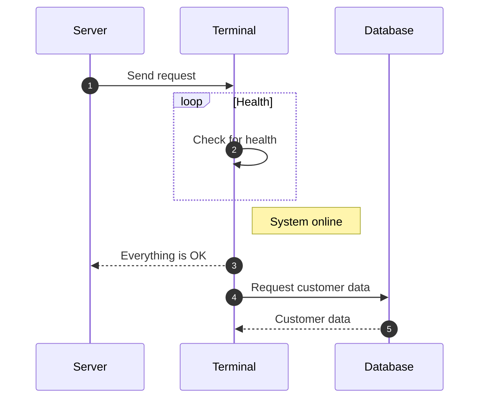
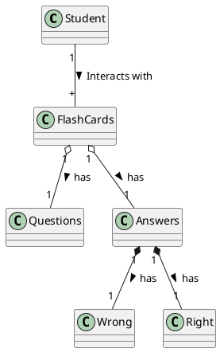

# Diagram Examples

## Flowcharts



## Sequence Diagrams



## C4 Model Example

```plantuml
@startuml
!define RECTANGLE class

RECTANGLE customer {
  :Personal Banking Customer;
  :A customer of the bank, with personal bank accounts.;
}

group "Bank plc" {
    RECTANGLE supportStaff {
      :Customer Service Staff;
      :Customer service staff within the bank.;
    }
    RECTANGLE backoffice {
      :Back Office Staff;
      :Administration and support staff within the bank.;
    }
    RECTANGLE mainframe {
      :Mainframe Banking System;
      :Stores all of the core banking information about customers, accounts, transactions, etc.;
    }
    RECTANGLE email {
      :E-mail System;
      :The internal Microsoft Exchange e-mail system.;
    }
    RECTANGLE atm {
      :ATM;
      :Allows customers to withdraw cash.;
    }
    RECTANGLE internetBankingSystem {
      :Internet Banking System;
      :Allows customers to view information about their bank accounts, and make payments.;
    }
}

customer --> internetBankingSystem : Views account balances, and makes payments using
internetBankingSystem --> mainframe : Gets account information from, and makes payments using
internetBankingSystem --> email : Sends e-mail using
email --> customer : Sends e-mails to
customer --> supportStaff : Asks questions to (Telephone)
supportStaff --> mainframe : Uses
customer --> atm : Withdraws cash using
atm --> mainframe : Uses
backoffice --> mainframe : Uses
@enduml
```

## C4 Model Example-2
